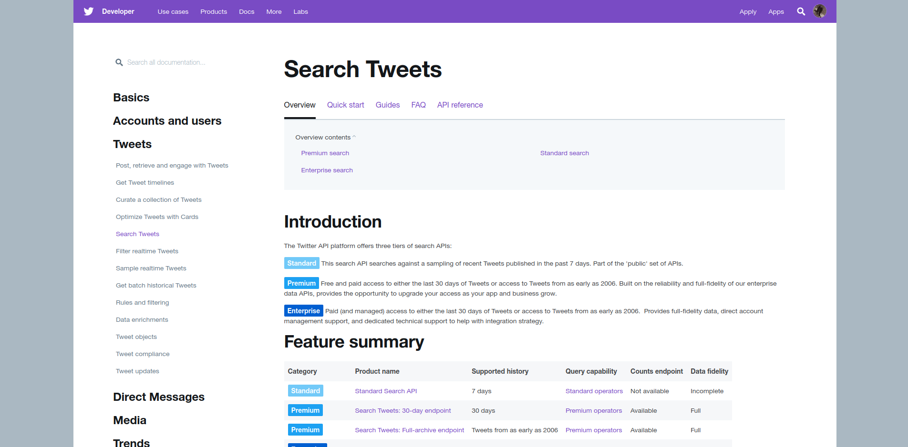

# Empowering social scientists with web mining tools

*FOSDEM 2020*

*Open Research Tools and Technologies Devroom*

*Guillaume Plique, SciencesPo médialab*

---

# Why and how to enable researchers to perform complex web mining tasks?

---

# What is web mining?

---

# Scraping

---

---

# Crawling

---

# Collecting data from APIs

---

# But why is this useful to [social] sciences?

---

## Bad take

1. Every social sciences data collection is biaised (i.e. observer's paradox)
2. People express themselves without being asked to, on the Internet
3. What's more they are not being observed (lol, I know...)
4. Web mining is therefore a superior source of data for social sciences!

---

## Good take

1. Internet data comes with its own biases that you should be aware of
2. Apply `media studies` and `STS` without moderation
3. Still is another data source. This cannot be shunned!

<!-- Note: Google Trends example -->

---

## Web mining is hard

You need to know The Web™:

`DNS` `HTTP` `HTML` `CSS` `JS` `DOM` `AJAX` `SSR` `CSR` `XPATH` ...

---

## How do you teach researchers web technologies

1. The same as anyone else really ([CSS as sushi plates anyone?](https://flukeout.github.io/))
2. What most consider as an easy layer of technologies really ISN'T
3. We really are standing on the shoulders of giants

---

## A point against the Jupyterization of researchers

1. Some researchers don't have the **time** nor the **will** to learn how to do advanced computer stuff.
2. This should be **OK**!

---

## Web mining is H.A.R.D.

It really is a craftsmanship.

---

## Internet is a dirty, dirty place

Browsers truly are heuristical wonders!

---

## Multithreading, parallelization, throttling etc.

Once we cut access to Google to our whole university!

---

## Complex spidering, scalability, storage, indexing, recombobulation, steam engines, fancy boats, unionization, agility, upper management, Peters syndrom, eXtreme programming

*Most of it is irrelevant and made up but you get the point.*

---

## How do we empower researchers then?

---

## By designing tools suited to their research questions

---

# SciencesPo's médialab

<!-- so how do you empower researchers then: by designing tools -->
<!--

Plan:

* How do we try, in the médialab, to empower researchers with a wide array of webmining tools: brief presentation of the lab, its triangle and why it enables us to take a step back and achieve some R&D.
* Chronological story?
* Scraping and API "abusing" against platforms' hegemony

Tools:

* artoo.js
* minet
* Hyphe
* Gazouilloire

ToDo:

* Bookmarklets => how to scale with minet
* anecdote: scraping the web using Selenium losing your time when you could retro-engineer the AJAX API. Sometimes modern web practices give more than they take
* Add DIME and médialab logo
* Trade-off between empowering & scalability => what about a GUI for minet? We also need to design user paths
* Mention real research questions => from small (bookmarklet) to wide (polarisation)
* Hardships: badly coded websites (browser are a pile of very complex heuristics: page encoding how?), multithreading, throttling, proxies (how we cut all our university access to Google), complex spidering, scalability, storage, indexing etc.
* Relocalizing data collection on the researcher's end (sometimes you don't need a server etc. => ties to bookmarklet and a minet GUI)
* minet gifs
* how to teach researchers about the web technologies: the same as anyone (sushi CSS): empowering them by letting them script (should go before our opinion that one may not have the required time. vs. the notebook philosophy => webmining is a hard problem, requiring engineering skills) not saying they should not: just that some don't want to invest this kind of resources & time and they have the right to do so.
* we need to teach people how to scrape: legal issues in some countries => wiggling when publishing (the monkey army)
* minet low fi approach regarding dbs (reducing overhead) -> remove the cruft for people, make it easy to go down the scripting path again

-->
