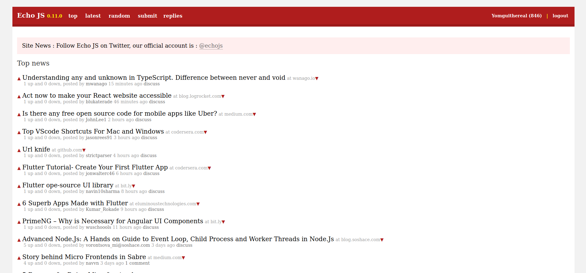
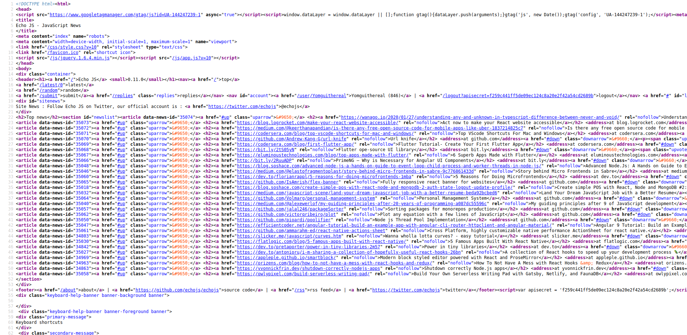
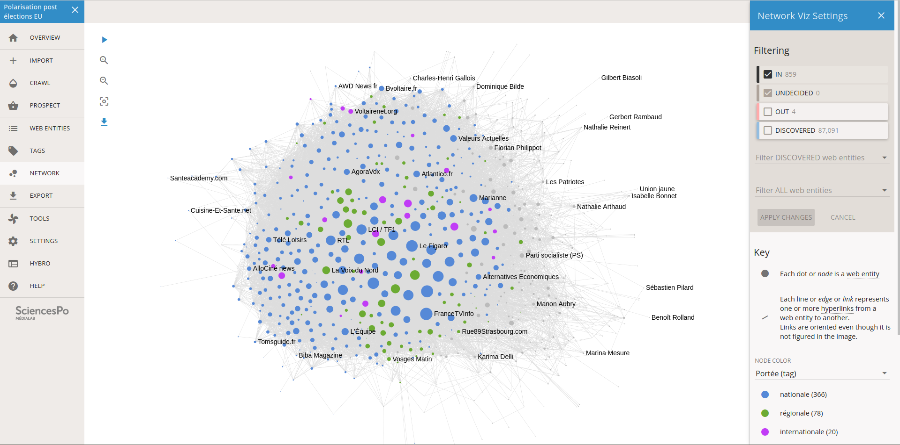

# Empowering social scientists with web mining tools

*FOSDEM 2020*

*Open Research Tools and Technologies Devroom*

*Guillaume Plique, SciencesPo médialab*

---

# Why and how to enable researchers to perform complex web mining tasks?

---

# What is web mining?

---

# Scraping

---

---

# Crawling

---

# Collecting data from APIs

<!--

Plan:

* Why is that useful to social sciences? Labov's paradox etc. => other biases, such as Google Trends drifting
* But webmining is hard: you need to master at least subsets of web technologies
* How do we try, in the médialab, to empower researchers with a wide array of webmining tools: brief presentation of the lab, its triangle and why it enables us to take a step back and achieve some R&D.
* Chronological story?
* Scraping and API "abusing" against platforms' hegemony

Tools:

* artoo.js
* minet
* Hyphe
* Gazouilloire

ToDo:

* Bookmarklets => how to scale with minet
* anecdote: scraping the web using Selenium losing your time when you could retro-engineer the AJAX API. Sometimes modern web practices give more than they take
* Add DIME logo
* Trade-off between empowering & scalability => what about a GUI for minet? We also need to design user paths
* Mention real research questions => from small (bookmarklet) to wide (polarisation)
* Hardships: badly coded websites (browser are a pile of very complex heuristics: page encoding how?), multithreading, throttling, proxies (how we cut all our university access to Google), complex spidering, scalability, storage, indexing etc.
* Relocalizing data collection on the researcher's end (sometimes you don't need a server etc. => ties to bookmarklet and a minet GUI)
* minet gifs
* how to teach researchers about the web technologies: the same as anyone (sushi CSS): empowering them by letting them script (should go before our opinion that one may not have the required time. vs. the notebook philosophy => webmining is a hard problem, requiring engineering skills) not saying they should not: just that some don't want to invest this kind of resources & time and they have the right to do so.

-->
